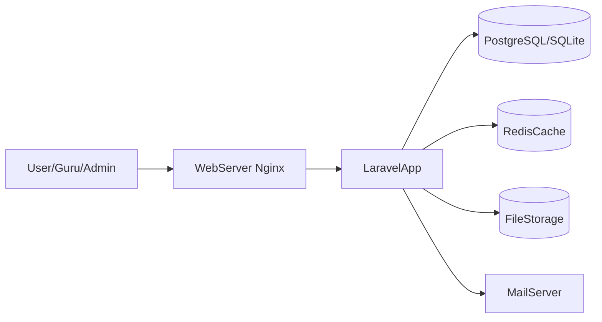

## Arsitektur & Stack LMS Laravel 12

### Stack Teknologi

- **Backend**: Laravel 12 (PHP 8.2+).
- **Frontend**: Blade, Tailwind CSS, sedikit Alpine.js (via Breeze).
- **Database**:
  - Dev: SQLite3.
  - Prod: PostgreSQL (atau MySQL) dengan skema sama.
- **Komponen pendukung**:
  - Redis (cache & queue) – opsional di dev, direkomendasikan di prod.
  - Storage lokal / object storage (untuk file materi).
  - SMTP/Mail provider untuk notifikasi email.

### Arsitektur Logis

- Lapisan **HTTP**: route + controller (auth, course, module, lesson, enrollment, assignment, quiz, announcement).
- Lapisan **Domain/Model**: model Eloquent (`User`, `Course`, `Module`, `Lesson`, `Enrollment`, dst.) dengan relasi jelas.
- Lapisan **Layanan Pendukung**:
  - Queue job (untuk proses berat: email, notifikasi massal, laporan).
  - Notifications (database + email) untuk pengumuman dan event penting.

### Diagram Aliran Sederhana

### Integrasi Modul `Linux` dan `BSD`

- Tabel `modules` memiliki:
  - `doc_source`: enum `linux` / `bsd` / `custom`.
  - `doc_path`: path relatif ke file README modul, misalnya:
    - `Linux/modules/module-01-introduction/README.md`
    - `BSD/modules/module-12-case-studies/README.md`
- Admin/guru memilih `doc_source` dan `doc_path` saat membuat modul, lalu mengisi `lessons` berdasarkan materi tersebut.

